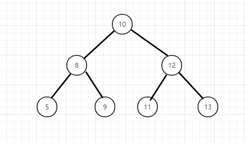

#使用栈的方式

如图：
```java
public int next() {
        while (currentNode!=null){
            nodeStack.push(currentNode);
            currentNode = currentNode.left;
        }
        currentNode = nodeStack.pop();
        int value = currentNode.val;
        currentNode = currentNode.right;
        return value;
    }
```

1.  第一次调用next()方法后 栈中的元素为： 10、8、5
2.  第一次从栈中弹出元素 5 输出第一个元素5，栈中的元素为： 10、8 
3. 5的右子树为空，第二次从栈中弹出元素8；输出元素 8  栈中的元素为： 10
4. 8的右子树不为空，第三次弹出元素9   栈中的元素为： 10、9 - > 10
5. 9的右子树为空，第四次弹出元素10，  栈中的元素为： null
6. 10的右子树不为空，栈中放入12    栈中的元素为： 12
    12的左子树不为空，栈中放入11    栈中的元素为： 12、11
    11的左子树不为空，第五次弹出元素11     栈中的元素为： 12
7. 11的右子树为空，第六次弹出元素12， 栈中的元素为： null
8. 12的右子树不为空，第七次弹出元素13
